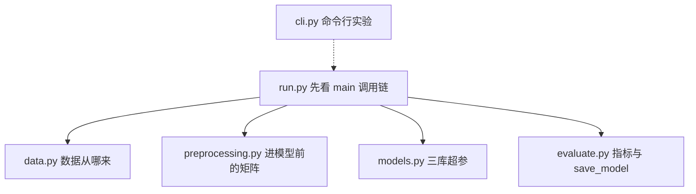

# 0_intro：三库对比 quickstart 阅读地图

本目录把原来的 [`quickstart_tree_models.py`](../quickstart_tree_models.py) 按职责拆成多个小文件，方便逐模块阅读。行为与拆分前一致。

## 怎么运行

```bash
cd XGBoost
source .venv/bin/activate

# 根目录薄入口（兼容旧命令）
python quickstart_tree_models.py --dataset synthetic --sample-size 60000

# 或直接跑模块
python -m 0_intro.run --dataset synthetic --sample-size 60000
python -m 0_intro.run --dataset adult
```

## 模块一览

| 文件 | 职责 | 对应原脚本行号 |
|------|------|----------------|
| [`config.py`](config.py) | 全局常量 `RANDOM_STATE` | 33 |
| [`cli.py`](cli.py) | 命令行参数解析 | 47–73 |
| [`data.py`](data.py) | 加载 synthetic / Adult 数据集 | 76–104 |
| [`preprocessing.py`](preprocessing.py) | 数值/类别特征预处理 pipeline | 107–135 |
| [`models.py`](models.py) | 构建 XGBoost / LightGBM / CatBoost 分类器 | 138–249 |
| [`evaluate.py`](evaluate.py) | 训练、评估指标、保存模型、打印结果 | 36–45, 146–271 |
| [`run.py`](run.py) | 串联全流程的 `main()` | 274–322 |

## 推荐阅读顺序



**第一遍（约 15 分钟）**

1. 打开 [`run.py`](run.py)，只看 `main()` 的调用顺序
2. 读 [`data.py`](data.py) + [`preprocessing.py`](preprocessing.py)，理解特征矩阵长什么样
3. 读 [`models.py`](models.py) 里 `XGBClassifier` 参数块——业务第一版最可能改这里
4. 读 [`evaluate.py`](evaluate.py) 的指标计算和 `save_model`——对应上线 artifact
5. 对照 [`evaluate.py`](evaluate.py) 的 `print_results` 理解终端输出

**第二遍（对照业务）**

把 `y` 想成 `accept_this_wave`，把 `feature_names` 想成 WaveRider 特征契约，把 `--output-dir` 想成需要版本管理的 model + preprocessor 目录。

## 与 Wave×Rider 接波意愿业务的映射

| quickstart 概念 | 你的业务概念 | 注意 |
|-----------------|-------------|------|
| 一行样本 `(x, y)` | 推荐时刻 `t` 下的 `(wave_id, rider_id)` 及是否接波 | 样本口径要统一「展示/未展示/拒绝」 |
| `load_dataset()` | 从离线表构造训练样本 | 第一处改代码通常是这里 |
| `build_preprocessor()` | 特征缺失填充、类别编码 | 编码器必须和模型一起版本化 |
| `train_test_split(stratify=y)` | **简化版**切分 | 生产应改为按时间切分 |
| `predict_proba[:, 1]` | `p_accept(wave, rider)` | 返回打分，不要硬 0/1 |
| `save_model` → json/txt/cbm | 线上推理加载的模型文件 | 同时保存 preprocessor |
| ROC-AUC / PR-AUC / Brier | 离线评估 | 还要看校准、Top-K、策略回放 |

## 按目标选文件

| 你的目标 | 建议打开 |
|----------|----------|
| 理解整体流程 | [`run.py`](run.py) → 本 README |
| 换自己的 CSV / 业务样本 | [`data.py`](data.py) |
| 学特征工程与编码 | [`preprocessing.py`](preprocessing.py) |
| 专注 XGBoost 参数 | [`models.py`](models.py) |
| 学评估指标与模型保存 | [`evaluate.py`](evaluate.py) |
| 命令行实验 | [`cli.py`](cli.py) |

更多业务背景见上级目录 [`README.md`](../README.md)。
